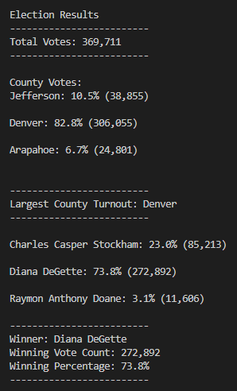

# Election Analysis

## Overview of Election Audit
A Colorado Board of Elections employee requested assistance with an audit of a recent local congressional election. To complete the audit, we needed to
calculate the total number of votes cast, provide a complete list of candidates who received votes, calculate the total number of votes each candidate received,
calculate the percentage of total votes each candidate received, and determine the winner of the election based on the popular vote. 

We also needed to provide a county-level view of the election. For this, we calculated the number of votes cast in each of the three counties covered in the 
election — Arapahoe, Denver and Jefferson — as well as the percentage of total votes by county. We were also tasked with determining which county had the largest
turnout, as measured by total number of votes and percentage of total votes cast.

## Election Audit Results
- Our analysis of the election shows that:
    - There were 369,711 votes cast in the election.
- Votes were cast in three counties:
    - Jefferson: 10.5% (38,855)
    - Denver: 82.8% (306,055)
    - Arapahoe: 6.7% (24,801)
- Denver had the largest number of votes.
- The candidates were:
    - Charles Casper Stockham
    - Diana DeGette
    - Raymon Anthony Doane
- The candidate results were:
    - Charles Casper Stockham received 23.0% of the vote with 85,213 votes.
    - Diana DeGette received 73.8% of the vote with 272,892 votes.
    - Raymon Anthony Doane received 3.1% of the vote with 11,606 votes.
- The winner of the election was:
    - Diana DeGette, who received 73.8% of the vote with 272,892 votes.



## Election Audit Summary
The script used to conduct this election audit used the following resources:
- Data source: election_results.csv
- Software: Python 3.10.5, Visual Studio Code 1.70.2

Analysts can use the script to audit any election, as long as officials provide the data in a CSV file that adheres to the following structure:

`Ballot ID, County, Candidate`

If officials preferred to see voter turnout figures for a location type other than county, we could quickly edit our script to accommodate that request upon 
receiving a CSV file with the same basic file structure but with a data header other than "County" in the appropriate location. For example:

`Ballot ID, City, Candidate`

In the script itself, if we wanted to provide a breakdown by city or state, we would change instances of the word "county" to "city" or "state" in the output text.

Before: 

```
with open(file_to_save, "w") as txt_file:

    # Print the final vote count (to terminal)
    election_results = (
        f"\nElection Results\n"
        f"-------------------------\n"
        f"Total Votes: {total_votes:,}\n"
        f"-------------------------\n\n"
        f"County Votes:\n")
    print(election_results, end="")

    txt_file.write(election_results)
```

After:

```
with open(file_to_save, "w") as txt_file:

    # Print the final vote count (to terminal)
    election_results = (
        f"\nElection Results\n"
        f"-------------------------\n"
        f"Total Votes: {total_votes:,}\n"
        f"-------------------------\n\n"
        f"City Votes:\n")
    print(election_results, end="")

    txt_file.write(election_results)
```

This change would need to happen in various other places in the script, but an analyst could make the changes in just a few minutes.

It would also be beneficial for that analyst to change variable names in the script. While not technically necessary, doing so would help avoid confusion over
what each variable represents. In the case of a city-focused election audit, we might make changes including the following.

Before:

```
# 1: Create a county list and county votes dictionary.
counties = []
county_votes = {}
```

```
# 2: Track the largest county and county voter turnout.
winning_county = ""
winning_count_county = 0
winning_percentage_county = 0
```

After:

```
# 1: Create a city list and city votes dictionary.
cities = []
city_votes = {}
```

```
# 2: Track the largest city and city voter turnout.
winning_city = ""
winning_count_city = 0
winning_percentage_city = 0
```
